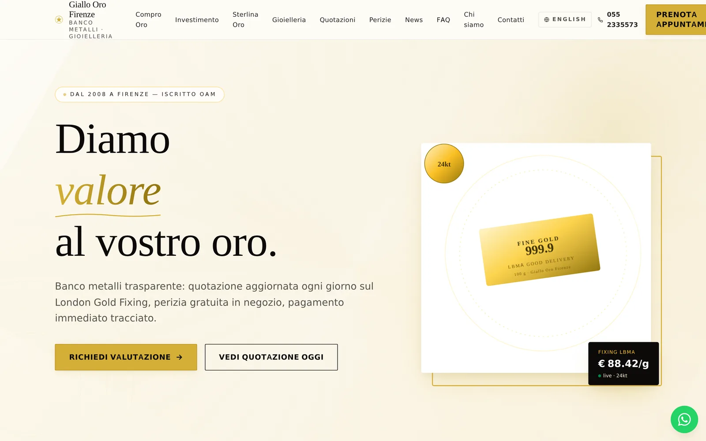
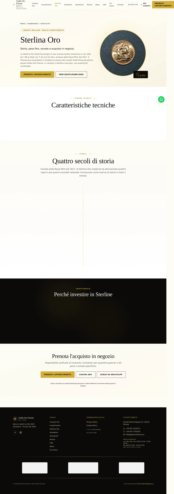
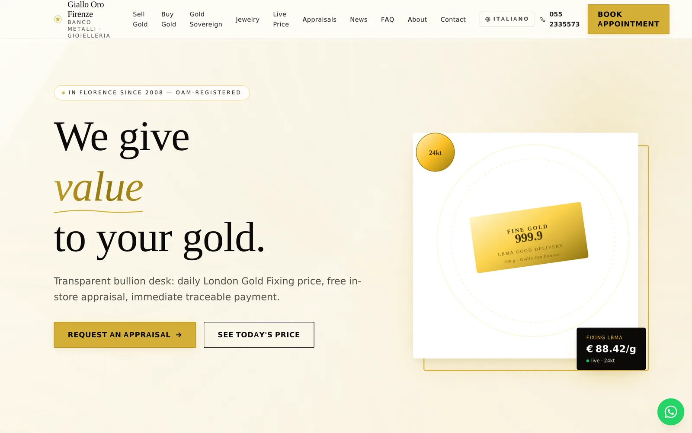
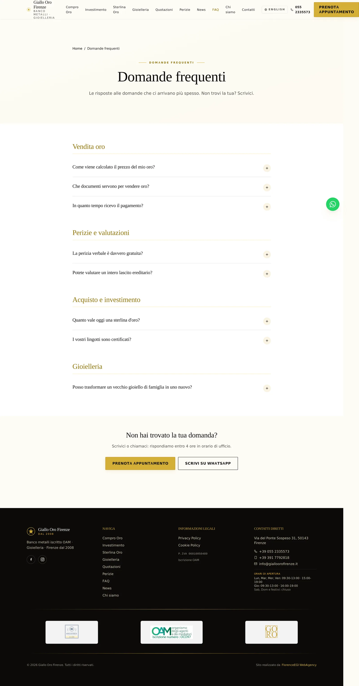
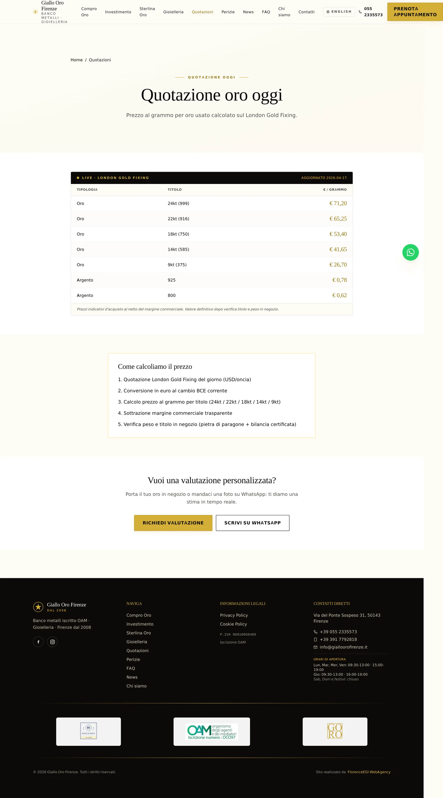
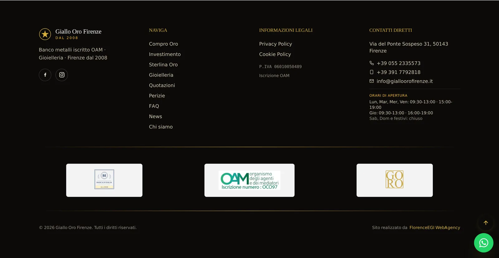

<div align="center">

# Giallo Oro Firenze

**Luxury business-card site for a Florentine gold-trading firm (Banco Metalli).**
**Sito vetrina di lusso per un Banco Metalli fiorentino.**

[](https://astro.build/)
[](https://www.typescriptlang.org/)
[](https://tailwindcss.com/)
[](#features)
[](#license)
[](https://florenceegi.com)



</div>

---

## Overview

Static marketing site for a **Banco Metalli** (gold-trading firm) in Florence. Built with **Astro 5 SSG**, fully bilingual **IT / EN**, cinematic yet restrained UX, strict WCAG AA and schema.org coverage end-to-end.

Shipped as a **portfolio piece** by **FlorenceEGI WebAgency** — our specialty is business-card sites for high-trust professionals (gold traders, lawyers, jewellers, notaries) where **credibility, bilingual reach and SEO** matter more than animations.

---

## Features

### Content — 24 pages, 2 locales
- Homepage cinematic hero, quote ticker, service cards
- Verticals: **Compro Oro · Investimento · Sterline · Gioielleria · Perizie · Quotazioni**
- Institutional: Chi siamo · Contatti (mail.php) · FAQ (8 Q&A)
- Legal: Privacy (GDPR) · Cookie · footer compliance strip
- Blog / News: 4 seed posts (2 IT + 2 EN) via Astro Content Collections + MDX
- Complete EN mirror: `/en/buy-gold`, `/en/sovereigns`, `/en/jewelry`, `/en/appraisals`, `/en/live-price`, `/en/faq`, `/en/sell-gold`, `/en/news`, ...

### UX — Cinematic but tasteful
- **Reveal on scroll** (IntersectionObserver, GPU-only transforms)
- **Magnetic CTAs**, particle hero background, lightbox gallery
- **Live gold price ticker** (mock feed, hook-ready for real API)
- **Timeline storytelling** on the Sterline page (four centuries of history)
- **Compliance strip** in footer: OAM, Codice Antiriciclaggio, Banca d'Italia references



### SEO & Schema.org
- 7 schema types: `LocalBusiness`, `Service`, `FAQPage`, `BreadcrumbList`, `Article`, `Product`, `WebSite`
- Sitemap i18n-aware (`it-IT` / `en-US`) via `@astrojs/sitemap`
- `hreflang` tags, canonical URLs, OpenGraph, Twitter cards

### Accessibility
- Semantic HTML (`<nav>`, `<main>`, `<article>`, `<footer>`)
- Every icon-only button has `aria-label`; every form control has `<label for=...>`
- Colour contrast AA minimum (gold/ivory/charcoal palette)
- Keyboard-navigable throughout, focus rings visible, reduced-motion respected

### Performance
- **SSG** — zero JS by default, islands only where needed
- Image pipeline via `sharp` (WebP, AVIF, responsive `srcset`)
- Prefetch-on-viewport for internal links
- Inline critical CSS
- Lighthouse targets: **95+ / 100 / 95+ / 100** (Perf · A11y · BP · SEO)

### i18n architecture
- Astro native `i18n` config (`defaultLocale: 'it'`, prefix `/en` for English)
- Shared components (`Hero`, `Nav`, `Footer`), content duplicated per locale under `src/pages/` and `src/pages/en/`
- `hreflang` autoprinted on all pages

### PWA-ready
- `manifest.webmanifest` with proper icons
- Installable on iOS / Android
- Service worker scaffold (opt-in)

### Contact form — no backend required
- Pure `<form action="mail.php">` → classic PHP handler on static hosting with PHP (or can be swapped for a serverless function / Formspree / Cloudflare Worker)

---

## Screenshots

<table>
  <tr>
    <td></td>
    <td></td>
  </tr>
  <tr>
    <td align="center"><sub>English homepage (bilingual mirror)</sub></td>
    <td align="center"><sub>FAQ — schema.org FAQPage structured data</sub></td>
  </tr>
  <tr>
    <td></td>
    <td></td>
  </tr>
  <tr>
    <td align="center"><sub>Live quotazioni — London Gold Fixing ticker</sub></td>
    <td align="center"><sub>Compliance footer — OAM, AML, Banca d'Italia</sub></td>
  </tr>
</table>

<div align="center">
  
  <p><sub>Mobile-first hero — iPhone 14 viewport</sub></p>
</div>

---

## Stack & decisions

| Layer | Choice | Why |
|-------|--------|-----|
| Framework | **Astro 5.18** | SSG by default, zero-JS HTML, islands where needed. Perfect for content-heavy marketing sites. |
| Language | **TypeScript 5.9 strict** | Type safety on components, content collections, config. |
| Styling | **Tailwind v4.1** | `@tailwindcss/vite` plugin — no `tailwind.config.js`, CSS-first theming, faster dev server. |
| Content | **Astro Content Collections + MDX** | Type-safe frontmatter, markdown blog posts with components inline. |
| i18n | **Astro native** | No third-party i18n lib needed — `/` for IT, `/en` for EN, shared components, separate content trees. |
| Icons | **Inline SVG** | No icon font, no runtime dep, perfectly accessible. |
| Analytics | *(to wire)* | Plausible / Umami ready — GDPR-friendly, no cookie banner needed. |
| Hosting target | **Cloudflare Pages** (or Netlify) | Free tier, global CDN, automatic deploys from `main`. |
| Contact form | **PHP `mail.php`** | Zero-JS fallback; easily swappable for serverless. |

### Why SSG over SSR?
The content changes rarely (hours at worst, for gold prices). Live data (gold price) can be hydrated client-side from a micro-API or serverless function. SSG gives us:
- **LCP < 1s** on 4G realistically
- **Free hosting** on Cloudflare Pages / Netlify
- **Zero attack surface** — no server to hack
- **Immutable deploys** — rollback = previous Git commit

### Why Tailwind v4?
The new `@tailwindcss/vite` plugin removes `tailwind.config.js` entirely — theming moves into CSS custom properties. Dev server is noticeably faster, and the CSS output is smaller with the new engine.

### Why Astro Content Collections?
Blog posts are `.md` files with typed frontmatter (`src/content/blog/*.md`). Adding a new post = one file. Astro validates schema at build time, so broken frontmatter fails the build rather than production.

---

## Architecture

```
┌─────────────────────────────────────────────────────────────────┐
│                    gialloorofirenze.it                          │
│                                                                 │
│   ┌──────────────┐       ┌──────────────┐      ┌─────────────┐ │
│   │  Cloudflare  │  ──►  │  Astro SSG   │ ──►  │   HTML/CSS  │ │
│   │    Pages     │       │  build: dist/│      │ (static)    │ │
│   └──────────────┘       └──────────────┘      └─────────────┘ │
│          ▲                                            │        │
│          │                                            ▼        │
│   ┌──────────────┐                        ┌──────────────────┐ │
│   │  git push    │                        │  End user browser│ │
│   │    main      │                        │  LCP < 1s · A11y │ │
│   └──────────────┘                        └──────────────────┘ │
│                                                                 │
│   Future (optional):                                            │
│   ┌──────────────┐      ┌──────────────────┐                   │
│   │ Laravel CMS  │ ──►  │  Headless API    │  (separate repo)  │
│   │ (Blade+TS)   │      │  /api/blog       │                   │
│   └──────────────┘      └──────────────────┘                   │
└─────────────────────────────────────────────────────────────────┘
```

**Future CMS** — if the client ever needs self-service editing, a **separate Laravel 12 repo** (Blade + Vanilla TS + Tailwind, **no Filament / no Livewire / no Alpine**) will serve content via headless API. Astro build fetches at build time. This is the FlorenceEGI WebAgency default architecture.

---

## Project structure

```
src/
├── components/             # Shared .astro components
│   ├── Hero.astro
│   ├── Nav.astro
│   ├── Footer.astro
│   ├── ContactForm.astro
│   ├── FAQItem.astro
│   ├── GoldQuoteTable.astro
│   ├── SectionHeading.astro
│   ├── ServiceCard.astro
│   └── WhatsAppFab.astro
├── content/
│   ├── blog/               # IT + EN markdown posts
│   ├── faq/                # FAQ seeds
│   └── config.ts           # typed Content Collections schema
├── layouts/                # Base + page layouts
├── pages/
│   ├── index.astro         # IT homepage
│   ├── sterline.astro
│   ├── compro-oro.astro
│   ├── investimento.astro
│   ├── gioielleria.astro
│   ├── perizie.astro
│   ├── quotazioni.astro
│   ├── faq.astro
│   ├── contatti.astro
│   ├── chi-siamo.astro
│   ├── privacy.astro
│   ├── cookie.astro
│   ├── blog/
│   │   ├── index.astro
│   │   └── [slug].astro
│   └── en/                 # full English mirror
│       ├── index.astro
│       ├── sovereigns.astro
│       ├── buy-gold.astro
│       ├── sell-gold.astro
│       ├── jewelry.astro
│       ├── appraisals.astro
│       ├── live-price.astro
│       ├── faq.astro
│       ├── contact.astro
│       ├── about.astro
│       └── news/
├── scripts/                # TS islands (magnetic CTA, reveal, particles, lightbox)
└── styles/                 # Tailwind entry + custom CSS
public/
├── favicon.svg
├── manifest.webmanifest
├── robots.txt
├── mail.php                # contact form handler
├── images/
└── logos/
docs/
├── audit-gialloorofirenze-it.md  # content & SEO audit
├── audit-gialloorofirenze-it.pdf
└── screenshots/                   # README assets
```

---

## Run it locally

```bash
# requires Node 20+
npm install

# dev server on http://localhost:4330
npm run dev

# production build → dist/
npm run build

# preview built site
npm run preview
```

Extra scripts:

```bash
npm run scrape      # fetch reference assets (one-time)
npm run audit:pdf   # rebuild docs/audit-*.pdf (requires pandoc + xelatex)
```

---

## Deployment

Target: **Cloudflare Pages**.

1. Connect the GitHub repo on Cloudflare Pages.
2. Build command: `npm run build`
3. Build output directory: `dist`
4. Node version: `20`
5. Environment variables: *(none required for the static build)*

Custom domain → `gialloorofirenze.it`. TLS auto-provisioned by Cloudflare.

For the contact form, `public/mail.php` needs a host that executes PHP (any classic shared host works). For pure-static hosts, swap it for a Cloudflare Worker, Netlify Function, or Formspree endpoint.

---

## Browser support

Modern evergreen — **Chrome, Safari, Firefox, Edge** (last 2 versions each). No IE11. CSS relies on `@layer`, container queries and custom properties. Mobile tested on iOS 17+, Chrome Android 120+.

---

## License

**Proprietary — © FlorenceEGI WebAgency. All rights reserved.**

This repository is public for **portfolio / transparency** purposes only.
Code, copy, design, timeline content and screenshots are **not licensed** for reuse, redistribution, or derivative works without written permission from FlorenceEGI WebAgency.

For licensing inquiries or a similar build for your brand: [fabiocherici@gmail.com](mailto:fabiocherici@gmail.com).

---

<div align="center">

**Built by [FlorenceEGI WebAgency](https://florenceegi.com)**
_Padmin D. Curtis (AI Partner OS3.0) × Fabio Cherici_

_Part of the FlorenceEGI organism — Oracode OS3.0_

</div>
